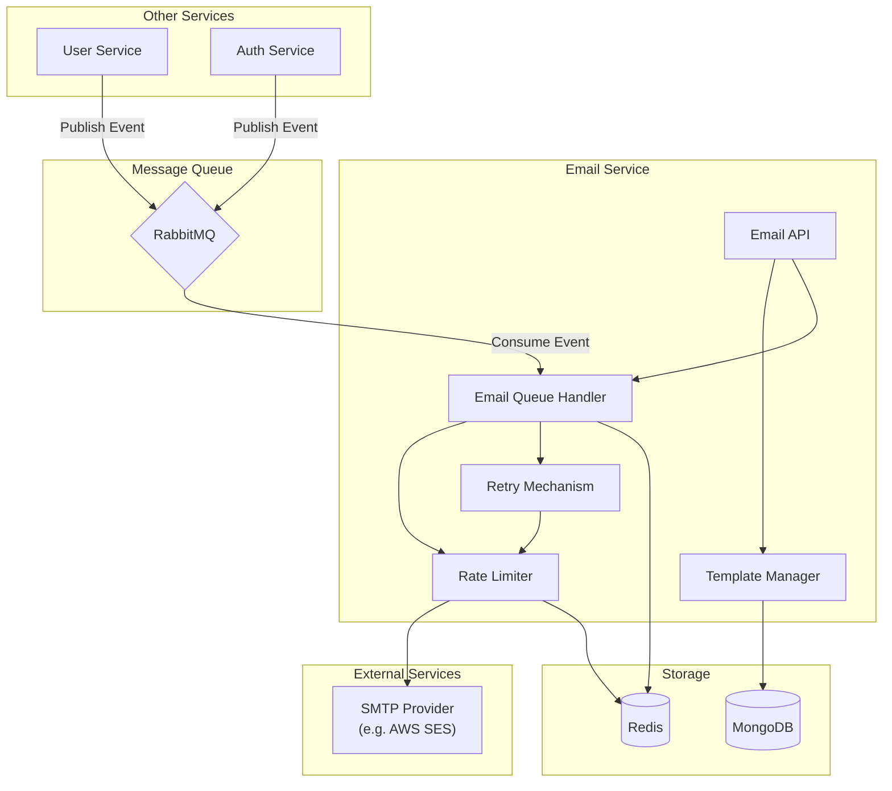
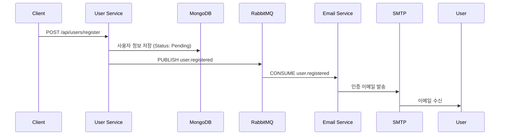
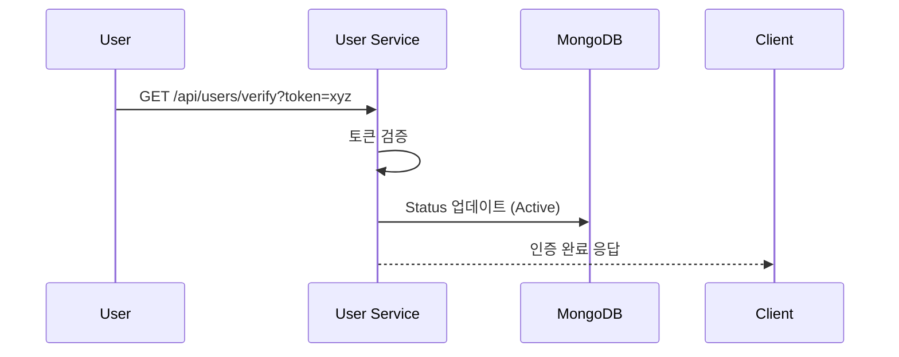

# qemai

## architecture

```mermaid
graph TB
    subgraph "Email Service"
        EmailAPI["Email API"]
        TemplateManager["Template Manager"]
        EmailQueue["Email Queue Handler"]
        RateLimiter["Rate Limiter"]
        Retry["Retry Mechanism"]
    end

    subgraph "Storage"
        MongoDB[(MongoDB)]
        Redis[(Redis)]
    end

    subgraph "Message Queue"
        RabbitMQ{RabbitMQ}
    end

    subgraph "External Services"
        SMTP["SMTP Provider\n(e.g. AWS SES)"]
    end

    subgraph "Other Services"
        UserService["User Service"]
        AuthService["Auth Service"]
    end

    %% Service connections
    UserService -->|Publish Event| RabbitMQ
    AuthService -->|Publish Event| RabbitMQ
    RabbitMQ -->|Consume Event| EmailQueue
    
    %% Internal flows
    EmailQueue --> RateLimiter
    RateLimiter --> SMTP
    EmailQueue --> Retry
    Retry --> RateLimiter
    
    %% Storage connections
    TemplateManager --> MongoDB
    EmailQueue --> Redis
    RateLimiter --> Redis

    %% API connections
    EmailAPI --> TemplateManager
    EmailAPI --> EmailQueue
```

## sign up flow

```mermaid
sequenceDiagram
    Client->>User Service: POST /api/users/register
    User Service->>MongoDB: 사용자 정보 저장 (Status: Pending)
    User Service->>RabbitMQ: PUBLISH user.registered
    RabbitMQ->>Email Service: CONSUME user.registered
    Email Service->>SMTP: 인증 이메일 발송
    SMTP->>User: 이메일 수신
```

## verify emial

```mermaid
sequenceDiagram
    User->>User Service: GET /api/users/verify?token=xyz
    User Service->>User Service: 토큰 검증
    User Service->>MongoDB: Status 업데이트 (Active)
    User Service-->>Client: 인증 완료 응답
```